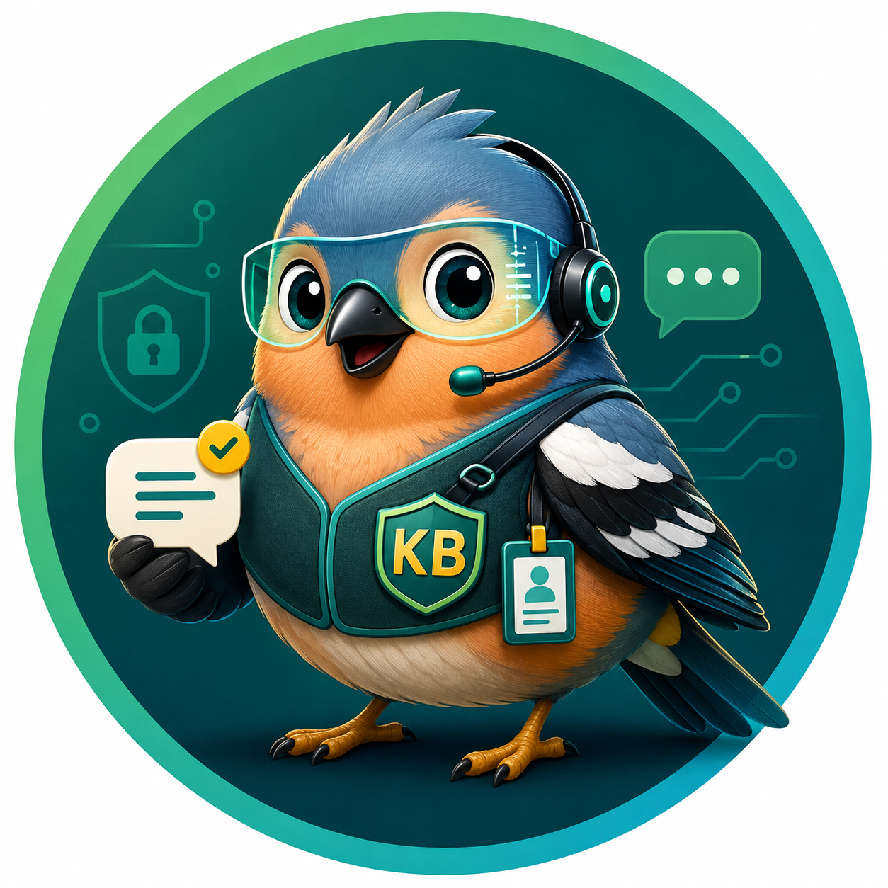

# Зяблик / Zyablik




Небольшой проект для доставки уведомлений из Zabbix в корпоративный мессенджер МАХ.

Смысл простой: события мониторинга должны быстро доходить до тех, кто за них отвечает. Рабочий канал Telegram не заменяется. МАХ добавляется как дополнительный канал доставки.

Проект не пытается быть большой платформой, SIEM-интеграцией или AI-помощником. Его основная задача — отправить уведомление из Zabbix в МАХ через отдельный Media type с типом `Webhook`.

## Что внутри

Проект поддерживает два пути доставки:

**Прямой путь** (Zabbix → MAX Bot API, для простых сценариев):

```text
Zabbix Action
  ├─ Telegram Webhook
  └─ MAX Webhook (max-webhook.js)
       └─ MAX Bot API
            └─ чат или пользователь в МАХ
```

**Путь через bot-platform** (Zabbix → HTTP-ingress → очередь → MAX Bot API, для multi-source):

```text
Zabbix Action
  └─ MAX Webhook (bot-platform-ingest.js)
       └─ POST /ingest (JWT auth)
            └─ Queue (at-least-once)
                 └─ Outbound → MAX Bot API
                      └─ чат или пользователь в МАХ

Другие источники (SIEM, API) → POST /ingest → Queue → MAX Bot API
```

Webhook-скрипты:

```text
src/zabbix-media-type/max-webhook.js         — прямой путь (Zabbix → MAX Bot API)
src/zabbix-media-type/bot-platform-ingest.js — через bot-platform (Zabbix → ingress → очередь → MAX)
```

Любой из скриптов можно вставить в поле `Скрипт` при создании Media type `MAX` в Zabbix.

## Быстрый старт

1. Открыть [INSTALL.md](INSTALL.md).
2. Создать в Zabbix Media type `MAX` с типом `Webhook`.
3. Вставить скрипт из `src/zabbix-media-type/max-webhook.js`.
4. Заполнить параметры по [docs/zabbix-media-type.md](docs/zabbix-media-type.md).
5. Проверить тестовую доставку, Problem и Recovery.

## Repo map

```text
.github/          GitHub Actions и шаблоны GitHub
.agents/          рабочий контекст AI-агентов
docs/             проектная и эксплуатационная документация
docs/decisions/   ADR и принятые решения
docs/identity-plugin/  Identity Plugin документация
examples/         обезличенные примеры параметров и чек-листы
infra/            инфраструктура (NanoIDP Docker setup)
src/              исходники webhook и bot-platform
systemd/          unit-файлы для bot-platform
tasks/            sprint plans
tests/            Node.js policy tests и unit tests
```

## Архитектура

Основные компоненты:

```text
Zabbix Media type (Webhook)
  ├─ src/zabbix-media-type/max-webhook.js
  │    └─ MAX Bot API → чат/пользователь в МАХ
  └─ src/zabbix-media-type/bot-platform-ingest.js
       └─ POST /ingest → Queue → Outbound → MAX Bot API → чат/пользователь

Bot-platform (identity bot + ingress)
  └─ src/bot-platform/app.js
       ├─ core/live-pipeline.js       обработка updates
       ├─ core/dry-run-pipeline.js    тестовый pipeline
       ├─ plugins/identity/           identity-сценарий
       ├─ transports/max/             транспорт MAX API
       ├─ ingress/                    HTTP-ingress (JWT auth, normalizers)
       │   ├── http-server.js         POST /ingest
       │   ├── jwt-source-auth.js     JWT-аутентификация
       │   ├── oidc-verifier.js       OIDC-верификатор
       │   └── normalizers/           нормализаторы источников
       └── queue/                     очередь доставки (SQLite)
            ├── store.js              SQLite store
            └── worker.js             retry + backoff
```

Ключевые архитектурные решения зафиксированы в ADR (`docs/decisions/`):

- ADR-0005: Hubot-based MVP MAX Identity Bot
- ADR-0012: convention-based plugin loader
- ADR-0015: нулевые внешние зависимости
- ADR-0017: внутренний контракт событий
- ADR-0018: pipeline command dispatch
- ADR-0019: outbound response shape extensibility (text-only ответы)
- ADR-0020: обработка bot_added событий
- ADR-0021: обработка bot_started событий
- ADR-0022: multi-source ingress + журналы
- ADR-0023: входящие HTTP в bot-platform (stdlib only)
- ADR-0024: @okta/jwt-verifier как исключение из ADR-0015
- ADR-0025: better-sqlite3 как исключение из ADR-0015
- ADR-0028: очередь доставки сообщений (delivery queue)
- ADR-0029: lifecycle audit trail (audit + trace)
- ADR-0030: outbound rate limiter для защиты от 429 MAX API
- ADR-0031: лицензия Apache-2.0, бренд «Зяблик», ренейминг в zyablik-bot

## Документация

Основные документы:

```text
INSTALL.md
docs/live-identity-bot.md
docs/identity-plugin/
docs/zabbix-media-type.md
docs/runbooks/live-identity-bot.md
docs/decisions/README.md
tasks/sprints/
CHANGELOG.md
```

Если нужно менять архитектуру, границы проекта, процесс разработки или внешние зависимости, сначала проверьте ADR в `docs/decisions/`.

## Команды

```bash
npm test
npm run verify
```

Обе команды запускают проверку репозитория через `node --test`.

## Безопасность

В репозиторий нельзя добавлять реальные токены, идентификаторы пользователей и чатов, внутренние URL, скриншоты с чувствительными данными и организационные названия.

Runtime-секреты хранятся только в Zabbix, локальном `.env` или защищенной конфигурации стенда.

## AI-ассистированная разработка

Проект использует внешний набор skills для AI-агентов:

```text
https://github.com/addyosmani/agent-skills
```

Skills применяются как рабочий процесс, а не как runtime-зависимость. Репозиторий не добавляется как submodule (ADR-0002).

Рекомендуемые skills:

```text
documentation-and-adrs — ADR, документация, фиксация контекста
spec-driven-development — спецификация перед кодом
planning-and-task-breakdown — декомпозиция задач
incremental-implementation — вертикальные слои
test-driven-development — тесты первой
code-review-and-quality — обзор перед слиянием
security-and-hardening — безопасность
```

ADR хранятся в `docs/decisions/`. Проектная документация — в `docs/`.

## Политика документации

Документация ведётся по принципу `documentation-and-adrs`: фиксируем не только что сделано, но и почему выбран именно такой вариант.

Когда создавать ADR:

- выбирается один из нескольких вариантов реализации
- решение будет трудно менять позже
- меняется архитектура или границы проекта
- новый внешний инструмент или зависимость

Каноничные места:

```text
README.md              краткое описание и быстрый вход
INSTALL.md             установка
AGENTS.md              правила для AI-агентов
docs/                  эксплуатационная документация
docs/identity-plugin/  Identity Plugin документация
docs/decisions/        ADR и история решений
CHANGELOG.md           заметные изменения
tasks/sprints/          sprint plans
```

## License

Проект лицензирован по [Apache License 2.0](LICENSE).

Авторское право © 2026 Kirill Fomichev.

Русская версия лицензии: [LICENSE.ru](LICENSE.ru).
